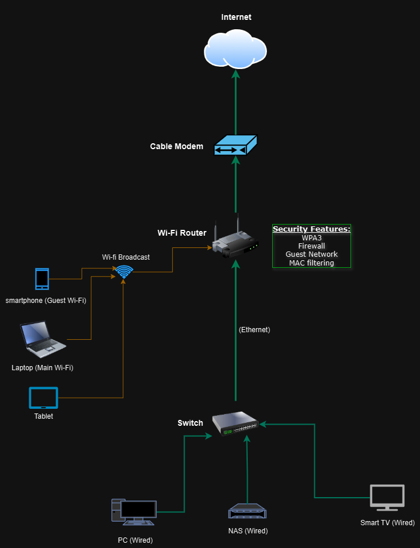

# 🔐 Secure Home Network Setup Guide

This project documents how to design and secure a typical home Wi-Fi network using best practices in cybersecurity. It includes an overview of device setup, Wi-Fi configuration, and security recommendations for protecting a home network.

---

## 📡 Devices in This Network

- Cable Modem
- Wi-Fi Router
- Network Switch
- Smartphone (Guest Wi-Fi)
- Laptop (Main Wi-Fi)
- Tablet
- PC (Wired)
- Smart TV (Wired)
- NAS (Network Attached Storage)

---

## 🧭 Network Diagram

---

## 🛡️ Wi-Fi Security Best Practices

1. **Change the default SSID (Wi-Fi name)**  
2. **Create a strong Wi-Fi password** using a password generator  
3. **Disable remote access** to the router  
4. **Enable WPA3 encryption** (if available)  
5. **Disable WPS (Wi-Fi Protected Setup)**  
6. **Use a separate Guest Network** for visitors  
7. **Change default router admin credentials**  
8. **Turn off Wi-Fi when away for extended periods**  
9. **Enable router firewall** and MAC address filtering (optional)

---

## 📶 Wireless Security Protocols Overview

| Protocol | Description |
|----------|-------------|
| **WEP** | Earliest protocol, weak 40-bit encryption, easily hackable, deprecated |
| **WPA** | Introduced TKIP encryption, better than WEP but still vulnerable |
| **WPA2** | Uses AES encryption, strong and still widely used |
| **WPA3** | Latest protocol, prevents password guessing, strongest encryption |
| **WPS** | Quick setup feature, vulnerable to brute force — should be disabled |

---

## 💡 Additional Security Tips

- Regularly check for firmware updates on your router
- Monitor connected devices through the admin panel
- Rename your guest network and limit its speed or access
- Review router logs occasionally for unknown access attempts

---

## 📁 Files Included

- `Basic-Home-Network-Setup.png`: A visual layout of the home network showing all devices and configurations.

---

## 🧠 Author

Created by **Dania Baouche**  
📂 GitHub: [DaniaTech](https://github.com/DaniaTech)

> ⚠️ *This guide is intended for educational purposes only. Security settings vary by device and ISP.*
